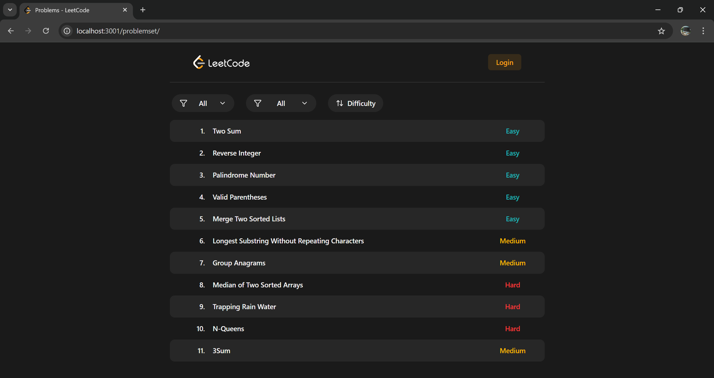
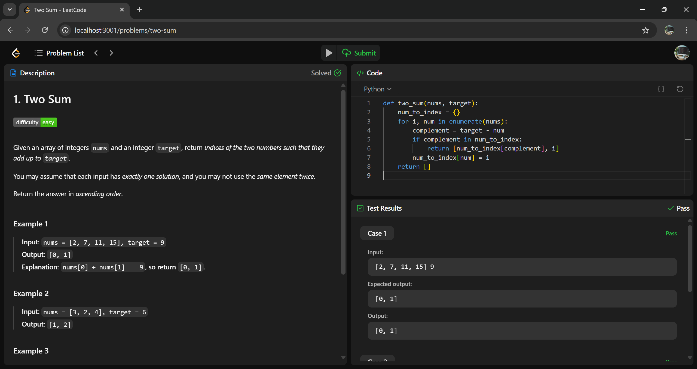

# CodeBench

A full-stack LeetCode-like online code judge and problem-solving platform.

---

## Table of Contents

* [Project Structure](#project-structure)
* [Features](#features)
* [Tech Stack](#tech-stack)
* [Running Locally with Docker Compose](#running-locally-with-docker-compose)
* [Screenshots](#screenshots)
* [Acknowledgements](#acknowledgements)

---

## Project Structure

```text
codebench/
├── rce/               # Backend (Spring Boot, MySQL, Judge0, GitHub OAuth)
├── leetcode-ui/       # Frontend (React + Vite + TypeScript + Monaco Editor)
├── mysql-init/        # MySQL initialization script
├── docker-compose.yml # Orchestration
└── README.md          # You're here!
```

---

## Features

* **Code Execution** using [Judge0 API](https://judge0.com/)
* **Authentication** via GitHub OAuth
* **Frontend** with LeetCode-like interface built in [Vite](https://vite.dev/) + TypeScript + [tailwindcss](https://tailwindcss.com/)
* **Editor** powered by [Monaco](https://www.npmjs.com/package/@monaco-editor/react)
* **Containerized** with Docker and orchestrated via `docker-compose`
* **Database Initialization** using `init.sql` on MySQL container startup

---

## Tech Stack

### Backend (`/rce`)

* Spring Boot (Java 21)
* MySQL 8
* Judge0
* Spring Security + OAuth2 (GitHub)

### Frontend (`/leetcode-ui`)

* React + Vite + TypeScript
* TailwindCSS
* Monaco Editor

### DevOps

* Docker + Docker Compose
* MySQL init script
* Environment-based configuration via `.env`

---

## Running Locally with Docker Compose

> Requires [Docker](https://docs.docker.com/get-docker/) and [Docker Compose](https://docs.docker.com/compose/install/)

### 1. Clone the Repository

```bash
git clone https://github.com/gh-yashk/codebench.git
cd codebench
```

### 2. Set Up Environment Variables

Create a `.env` file with the following:

```env
# MySQL
MYSQL_ROOT_PASSWORD=root

# Spring Boot
SPRING_DATASOURCE_URL=jdbc:mysql://mysql:3306/rce_db?createDatabaseIfNotExist=true
SPRING_DATASOURCE_USERNAME=root
SPRING_DATASOURCE_PASSWORD=root
FRONTEND_ORIGIN=http://localhost:3001

# External APIs
GITHUB_CLIENT_ID=
GITHUB_CLIENT_SECRET=
JUDGE0_API_KEY=
```

> You can get a free Judge0 API key from [RapidAPI](https://rapidapi.com/organization/judge0)

### 3. Start All Services

```bash
docker-compose up --build
```

### 4. Open the App

* frontend: [localhost:3001](http://localhost:3001)
* backend: [localhost:8081](http://localhost:8081)

---

## Screenshots





> See more in [/screenshots](./screenshots/)

---

## Acknowledgements

* [Judge0](https://judge0.com/)
* [Spring Boot](https://spring.io/)
* [Vite](https://vite.dev/)
* [Monaco Editor](https://www.npmjs.com/package/@monaco-editor/react)
* [Docker](https://www.docker.com/)
* [GitHub OAuth](https://docs.github.com/en/developers/apps/building-oauth-apps)

---
